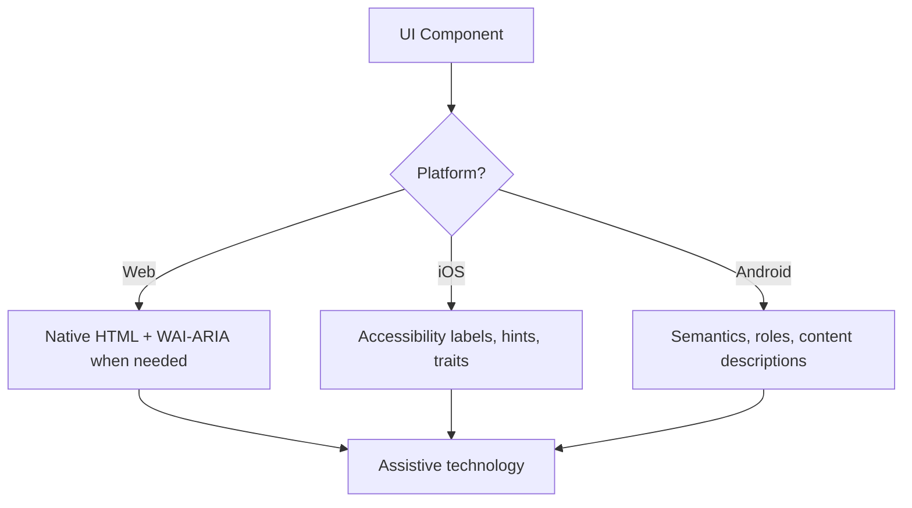

# Accessibility platform mapping

## Architecture

## Cross-platform mapping

| Need | Web | iOS / SwiftUI | Android / Compose |
| --- | --- | --- | --- |
| Primary label | Visible `<label>`, text content, or `aria-label` | `.accessibilityLabel()` | `contentDescription` or semantics text |
| Secondary help | `aria-describedby` | `.accessibilityHint()` | `stateDescription` / supporting text |
| Button role | Native `<button>` preferred; `role="button"` only for custom controls with keyboard support | `.accessibilityAddTraits(.isButton)` | `Modifier.semantics { role = Role.Button }` |
| State | `aria-expanded`, `aria-pressed`, `aria-selected`, etc. | value/traits/state labels | `stateDescription`, `toggleableState`, selected state |
| Live update | `role="status"`, `role="alert"`, or `aria-live` | platform announcements/live-region APIs when appropriate | `liveRegion = LiveRegionMode.Polite` or assertive equivalents |
| Hidden decorative content | `alt=""`, `aria-hidden="true"` | hide from accessibility tree when decorative | omit content description / clear semantics |

## Selection rules

1. Start with native controls and visible labels.
2. Add ARIA/platform metadata only to fill a real accessibility-tree gap.
3. Keep visible text, accessible names, hints, and state synchronized.
4. Test with keyboard and at least one screen-reader or platform accessibility inspector when possible.
